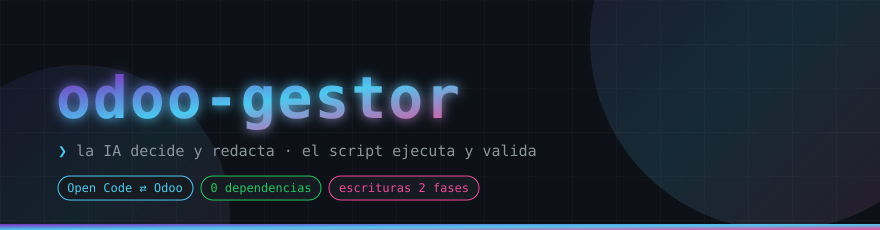
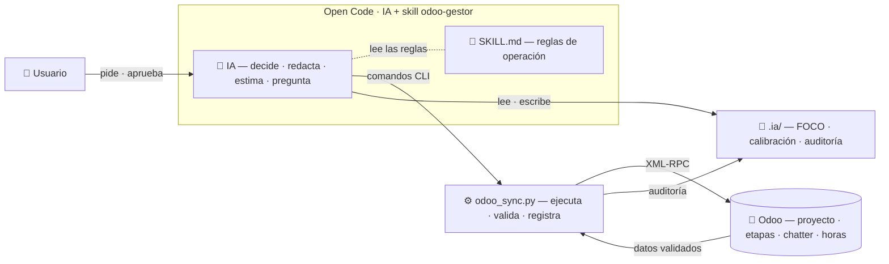
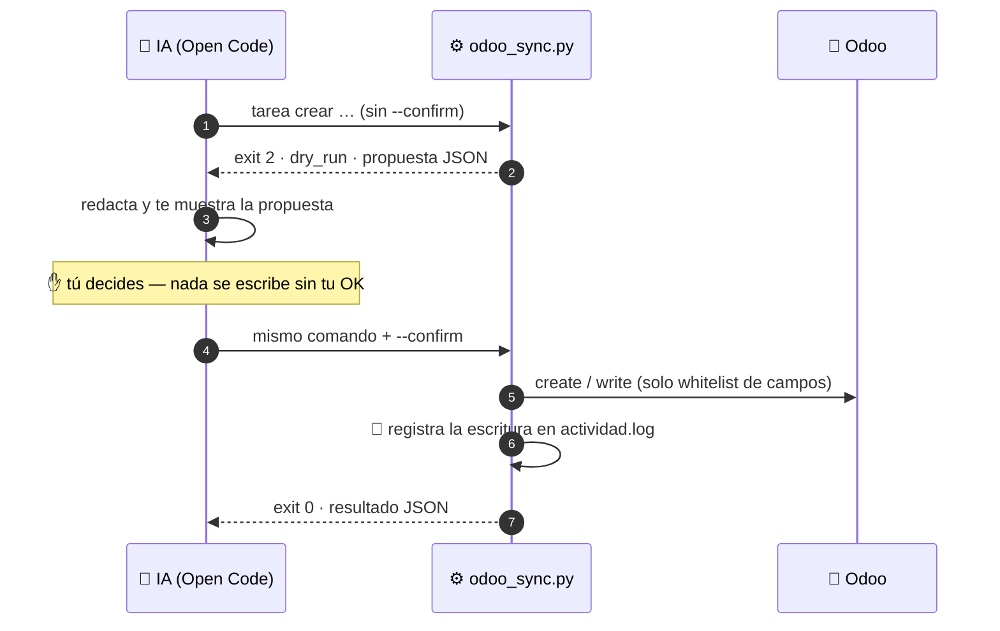

<!-- ✏️ PENDIENTE: docs/screenshots/*.gif → GIFs de terminal por grabar (ver 📸 Galería) -->

<div align="center">

<a href="#-instalación">
  
</a>

### Convierte a tu IA de desarrollo en un **project manager** con acceso real a Odoo.

**Sin alucinaciones de campos** · **sin credenciales en el contexto** · **con memoria entre sesiones** · **con tu OK antes de cada escritura**

[](#)
[](#)
[](#)
[](#)

[](#)
[](#)
[](#)
[](#)
[](#)

<a href="#-cómo-funciona">
  
</a>

[⚙️ Instalación](#-instalación) · [⌨️ CLI](#-referencia-del-cli) · [🏗️ Arquitectura](#-arquitectura) · [🗺️ Roadmap](#-roadmap) · [🤝 Contribución](#-contribución)

</div>

<p align="center"></p>

<details>
<summary>🧭 <b>Índice</b></summary>

- [📊 La skill en cifras](#-la-skill-en-cifras)
- [🔎 El problema](#-el-problema)
- [✨ La solución](#-la-solución)
- [🧭 Cómo funciona](#-cómo-funciona)
  - [El reparto de papeles](#el-reparto-de-papeles)
  - [Las 7 reglas de oro](#las-7-reglas-de-oro)
- [🏗️ Arquitectura](#️-arquitectura)
- [🛡️ Escrituras en dos fases](#️-escrituras-en-dos-fases)
- [⌨️ Referencia del CLI](#️-referencia-del-cli)
- [📸 Galería](#-galería)
- [⚙️ Instalación](#️-instalación)
  - [Requisitos](#requisitos)
  - [1 · Instala la skill (una sola vez)](#1--instala-la-skill-una-sola-vez)
  - [2 · Prepara Odoo (una vez por servidor)](#2--prepara-odoo-una-vez-por-servidor)
  - [3 · Vincula cada repo (una vez por proyecto)](#3--vincula-cada-repo-una-vez-por-proyecto)
  - [4 · Primer uso](#4--primer-uso)
- [🗺️ Roadmap](#️-roadmap)
  - [v1.0 — diseño aprobado → implementación](#v10--diseño-aprobado--implementación)
  - [Ideas futuras *(sugerencias — edítalas)*](#ideas-futuras-sugerencias--edítalas)
- [🤝 Contribución](#-contribución)
  - [Antes de empezar](#antes-de-empezar)
  - [Flujo](#flujo)
  - [Qué se acepta y qué no](#qué-se-acepta-y-qué-no)
  - [Convención de nombres](#convención-de-nombres)
- [📄 Licencia](#-licencia)
- [👤 Autor](#-autor)

</details>

## 📊 La skill en cifras

<div align="center">

| 🔧 Dependencias | 🌉 Puentes a Odoo | 🛡️ Fases por escritura | 🧪 Niveles de prueba | ⌨️ Grupos de comandos |
|:---:|:---:|:---:|:---:|:---:|
| **0** · solo stdlib | **1** · `odoo_sync.py` | **2** · dry-run → `--confirm` | **3** · unit · integración · IA | **10** · tareas, chatter, horas… |

</div>

<p align="center"></p>

## 🔎 El problema

Tu IA de desarrollo necesita gestionar el proyecto Odoo del repo en el que trabaja:
crear tareas, mover etapas, informar en el chatter, registrar horas. Pero dejada a su
instinto, esto es lo que pasa:

| 😱 Sin odoo-gestor | 😌 Con odoo-gestor |
|---|---|
| Improvisa llamadas RPC y **alucina nombres de campos** | `doctor` detecta los campos reales de cada instancia |
| Credenciales flotando en el contexto de la conversación | Solo `odoo_sync.py` las lee — la IA jamás las toca |
| «¿qué hora es?» → la IA inventa un reloj interno | `now` es la única fuente de verdad del tiempo |
| Cada sesión empieza **de cero** | `.ia/FOCO.md` guarda el foco y se retoma al iniciar |
| Estimaciones a ciegas | `calibracion` calcula ratios reales **por modelo de IA** |
| Escrituras sorpresa en Odoo | dry-run → propuesta → **tu OK** → `--confirm` |
| «¿qué ha tocado la IA y cuándo?» | `actividad.log` audita toda escritura aplicada |

## ✨ La solución

Una **skill global de Open Code** (instrucciones + CLI determinista) más una carpeta
local `.ia/` en cada repo (configuración, foco, calibración, auditoría). La filosofía
cabe en una línea:

> **La IA decide y redacta; el script ejecuta, valida y registra.**

<p align="center"></p>

## 🧭 Cómo funciona

### El reparto de papeles

| Actor | Papel |
|---|---|
| 🧠 La IA | Decide, redacta, estima, pregunta, propone |
| ⚙️ `odoo_sync.py` | Ejecuta, valida, registra, da la hora y calcula ratios |
| 🏢 Odoo | Ventana ejecutiva (para el jefe): etapas, chatter, horas |
| 🗂️ Repo / commits | Vista técnica (para el programador) |
| 👤 Tú | **Única autoridad para aprobar escrituras** |

### Las 7 reglas de oro

1. La IA decide y redacta; **el script ejecuta, valida y es la fuente de verdad**.
2. **1 repo = 1 proyecto Odoo** — guard anti-mezcla: la IA solo toca el proyecto de `.ia/config.json`.
3. Escrituras **en dos fases**: dry-run → propuesta visible → tu OK → `--confirm`.
4. Fuentes de verdad únicas: la hora la da `now`, los ratios `calibracion stats`, los campos `doctor`.
5. **Anti-invención**: toda afirmación es trazable (archivos, commits, tests o dicho por ti). Sin dato → «no disponible».
6. **Autónomo lo local, confirmado lo oficial**: FOCO y calibración se actualizan solos; todo lo que llega a Odoo se aprueba.
7. **Fallos explícitos**: el error se reporta tal cual; jamás workarounds con RPC propio.

<p align="center"></p>

## 🏗️ Arquitectura



<details>
<summary><b>📁 Mapa de archivos y qué problema resuelve cada uno</b></summary>

```text
~/.config/opencode/skill/odoo-gestor/          [GLOBAL — idéntico en todos los proyectos]
├── SKILL.md                     ← reglas y protocolos que lee la IA
├── odoo_sync.py                 ← único puente a Odoo (CLI)
├── plantillas/
│   ├── FOCO.md                  ← plantilla del foco por repo
│   └── calibracion.md           ← cabecera del archivo por modelo
└── tests/
    ├── test_odoo_sync.py        ← unitarios (sin Odoo)
    └── INTEGRACION.md           ← checklist de pruebas contra Odoo

<repo>/                                          [POR PROYECTO]
├── .ia/
│   ├── config.json     (V)      ← mapeo repo↔proyecto, campos, etapas, convención
│   ├── .env            (L)      ← credenciales — NUNCA versionar
│   ├── FOCO.md         (L)      ← foco actual de la IA
│   ├── actividad.log   (L)      ← auditoría de toda escritura
│   ├── calibracion/    (L)      ← un .md por modelo de IA
│   └── tmp/            (L)      ← borradores (resúmenes antes del chatter)
└── .gitignore                    ← entradas odoo-gestor
```

*(V) = versionado · (L) = local, en `.gitignore`*

| Archivo | Problema que resuelve |
|---|---|
| `SKILL.md` | La IA no recuerda reglas entre sesiones |
| `odoo_sync.py` | Alucinaciones RPC, credenciales expuestas, hora incierta, formatos inconsistentes |
| `.ia/config.json` | Cada instancia de Odoo es custom: campos y etapas difieren |
| `.ia/.env` | Secretos fuera del repo **y fuera del contexto de la IA** |
| `.ia/FOCO.md` | Pérdida de contexto al cerrar/abrir sesión |
| `.ia/calibracion/` | Estimaciones ciegas: cada modelo de IA tarda distinto |
| `.ia/actividad.log` | «¿Qué tocó la IA y cuándo?» — auditoría |
| `plantillas/` | Arranque uniforme en nuevos proyectos |
| `tests/` | Validar las herramientas **antes de confiar en ellas** |

</details>

<p align="center"></p>

## 🛡️ Escrituras en dos fases

El corazón de la seguridad del sistema: **nada llega a Odoo sin tu OK explícito**.



**Códigos de salida** (contrato estable, siempre JSON por stdout):

| Exit | Significado |
|:---:|---|
| `0` | OK |
| `1` | Error (mensaje claro, sin traceback crudo) |
| `2` | dry-run correcto — pendiente de `--confirm` |

**Garantías en cada escritura confirmada:**

- Solo se escriben campos de la **whitelist** (`name`, `description`, `date_deadline`, `planned_hours`)
- Se registra automáticamente en `.ia/actividad.log`
- Las credenciales nunca entran en el contexto de la conversación

<p align="center"></p>

## ⌨️ Referencia del CLI

<details open>
<summary><b>Los 10 grupos de comandos de <code>odoo_sync.py</code></b></summary>

| Comando | Tipo | Confirmación | Exit |
|---|---|---|:---:|
| `now` | lectura local | — | `0` |
| `doctor [--proyecto ID]` | diagnóstico | — *(escribe config local)* | `0 · 1` |
| `proyecto info` | lectura | — | `0 · 1` |
| `tarea get ID` · `tarea list` | lectura | — | `0 · 1` |
| `tarea crear · editar · etapa · estado` | **escritura** | dry-run → `--confirm` | `2 · 0 · 1` |
| `chatter post ID --desde-archivo f.md` | **escritura** | dry-run → `--confirm` | `2 · 0 · 1` |
| `horas registrar ID --horas X` | **escritura** | dry-run → `--confirm` | `2 · 0 · 1` |
| `ticket vincular ID --ticket N` | **escritura** | dry-run → `--confirm` | `2 · 0 · 1` |
| `calibracion stats · registrar` | local | — | `0 · 1` |
| `raw --modelo M --domain '[...]'` | **solo lectura** | — | `0 · 1` |

> 💡 **Convención para textos largos:** `--descripcion @archivo.md` y
> `--notas @archivo.md` leen el contenido desde archivo — evita el escaping de
> bash y garantiza que lo publicado es **exactamente** lo que aprobaste.

</details>

<p align="center"></p>

## 📸 Galería

> ⚠️ **TODO:** para una skill, las "capturas" son sesiones de terminal. Graba con
> *asciinema* (exportable a GIF) o *ScreenToGif* y guarda en `docs/screenshots/`.
> Estas dos valen oro para quien evalúe el repo:

<div align="center">

**🛡️ El flujo de dos fases — dry-run → propuesta → OK → confirm**


**🧠 Arranque de sesión — checklist automático y resumen de 3 líneas**


</div>

<p align="center"></p>

## ⚙️ Instalación

### Requisitos

| Requisito | Versión | Notas |
|---|---|---|
| Python | 3.14.0 ✔ | **Solo librería estándar** — nada que instalar |
| Odoo | Community **18.0-20260619** ✔ | Probado en local vía Docker (`odoo:18`) |
| Open Code | **1.18.30** ✔ | Con skills globales activadas |
| Docker | **28.5.1** ✔ | Entorno de pruebas: Odoo 18 + PostgreSQL 16 |
| SO | Windows 10 Pro (probado) ✔ | Rutas `~/.config/opencode/…` compatibles en Windows, macOS y Linux |

### 1 · Instala la skill (una sola vez)

El clone **es** la instalación:

```bash
git clone https://github.com/portafolioingenierojavier/odoo-gestor.git \
  ~/.config/opencode/skill/odoo-gestor

# Verificación: tests unitarios (nivel 1 — no necesitan Odoo)
cd ~/.config/opencode/skill/odoo-gestor
python3 -m unittest tests/test_odoo_sync.py -v
```

> 💡 **Versión en desarrollo:** desde el repo de desarrollo usa `bash instalar.sh`,
> que crea el symlink `~/.config/opencode/skill/odoo-gestor` → tu repo (en Windows
> usa un junction, equivalente transparente).

### 2 · Prepara Odoo (una vez por servidor)

1. Modo desarrollador → Ajustes → Usuarios → **nuevo usuario «IA Sync»** (interno, grupo *Proyecto/Usuario*).
2. Preferencias del usuario IA Sync → **Claves API** → nueva clave `opencode` *(cópiala: no vuelve a mostrarse)*.
3. Zona horaria del usuario IA Sync = la tuya (timestamps correctos).
4. Si vas a usar timesheets: crea un **empleado «IA Sync»** en RRHH vinculado a ese usuario.
5. Crea un proyecto **QA-SKILL** con las etapas estándar — **nunca valides escrituras contra el proyecto real**.

### 3 · Vincula cada repo (una vez por proyecto)

```bash
# 1 · carpeta local de la skill
mkdir -p .ia

# 2 · credenciales — NUNCA versionar
cat > .ia/.env <<'EOF'
ODOO_URL=http://mi-servidor:8069
ODOO_DB=mi_base
ODOO_USER=ia.sync@miempresa.com
ODOO_API_KEY=xxxxxxxxxxxxxxxx
EOF

# 3 · protege los archivos locales
cat >> .gitignore <<'EOF'
.ia/.env
.ia/FOCO.md
.ia/actividad.log
.ia/calibracion/
.ia/tmp/
EOF

# 4 · genera la configuración y revísala
python3 ~/.config/opencode/skill/odoo-gestor/odoo_sync.py doctor --proyecto <ID>
```

Valida el plan completo de `tests/INTEGRACION.md` sobre **QA-SKILL** antes de
conectar el proyecto real.

### 4 · Primer uso

Abre Open Code en el repo. La IA ejecuta sola el checklist de arranque:
`now` → lee FOCO → `calibracion stats` → últimas líneas del log → te resume el
estado en 3 líneas y confirma qué tarea se retoma.

<p align="center"></p>

## 🗺️ Roadmap

### v1.0 — diseño aprobado → implementación

- [x] Diseño de la arquitectura v1.0 (`ARQUITECTURA.md` como fuente única de verdad)
- [x] `odoo_sync.py`: 10 grupos de comandos, whitelist, dos fases, JSON por stdout
- [x] `SKILL.md`: reglas, arranque de sesión, ciclo de tarea, protocolo de tiempo
- [x] Plantillas de FOCO y calibración
- [x] Tests unitarios — nivel 1 sin Odoo (**50/50 en verde**)
- [x] Plan de validación de 3 niveles (`tests/INTEGRACION.md`)
- [x] **Fases 1–9 completas con sus gates G1–G9 en verde**: `now`, `doctor`, tareas,
  chatter, horas, tickets, calibración de tiempos, `raw` (solo lectura) y auditoría
  de seguridad 5/5
- [ ] Fase 10 — **DoD Nivel 2**: instalación vía symlink y regresión total desde
  cero (batería N0 + N1 + N2, 2.1–2.18) ← **siguiente hito**
- [ ] Validación nivel 3: comportamiento de la IA en sesión real
- [ ] Primera release etiquetada — `v1.0.0`

### Ideas futuras

- [ ] Informes semanales automáticos desde `actividad.log`
- [ ] Sync bidireccional FOCO ↔ Odoo
- [ ] Soporte de módulos de tickets de la comunidad OCA
- [ ] SKILL.md en inglés (manteniendo español en lo que llega a Odoo)
- [ ] Distribución como paquete instalable

<p align="center"></p>

## 🤝 Contribución

¡Las contribuciones son bienvenidas! Pero este proyecto tiene **reglas duras por
diseño** — toda contribución debe respetarlas.

### Antes de empezar

Abre un **issue** describiendo el problema o la idea. Se discute, se decide y
después se codea.

### Flujo

1. Fork + rama con la convención del propio proyecto: `git checkout -b FEAT-42-modo-informe`
2. Desarrolla respetando las 7 reglas de oro
3. Tests de nivel 1 en verde: `python3 -m unittest tests/test_odoo_sync.py -v`
4. Si añades comandos al CLI → actualiza también `SKILL.md` y `tests/INTEGRACION.md`
5. Abre el PR con título `[TIPO] resultado observable ≤ 70 caracteres`

### Qué se acepta y qué no

| ✅ Bienvenido | ❌ No pasa el review |
|---|---|
| Nuevos comandos del CLI (con dry-run, whitelist y auditoría) | XML-RPC improvisado fuera de `odoo_sync.py` |
| Más tests (unitarios o casos de `INTEGRACION.md`) | Escrituras en Odoo sin las dos fases |
| Mejoras de mensajes de error | Dependencias externas — se mantiene solo stdlib |
| Documentación y ejemplos | Credenciales en el repo o en el contexto de la IA |
| Detección de nuevos campos/etapas vía `doctor` | Romper el contrato de salida JSON por stdout |

### Convención de nombres

La del propio proyecto: **`[TIPO] título ejecutivo`** — ≤ 70 caracteres, resultado
observable, no técnica interna. Tipos: `FEAT FIX REF DOC OPS SEC TST CHK`.

<p align="center"></p>

## 📄 Licencia

Distribuido bajo la licencia **MIT**. Consulta [`LICENSE`](LICENSE) para más información.

## 👤 Autor

**Luis Javier Espinosa Cutié** — *Ingeniero Informático*

- 📧 [ingenieroinformaticojavier@proton.me](mailto:ingenieroinformaticojavier@proton.me)
- 🐙 [GitHub — @portafolioingenierojavier](https://github.com/portafolioingenierojavier)
- 💼 [LinkedIn — luis-javier-espinosa-cutié](https://www.linkedin.com/in/luis-javier-espinosa-cuti%C3%A9-174703363)

<div align="center">

<p align="center"></p>

**odoo-gestor** — *la IA decide · el script ejecuta · Odoo registra.*

⭐ Si la skill te resulta útil, una estrella se agradece mucho.

</div>